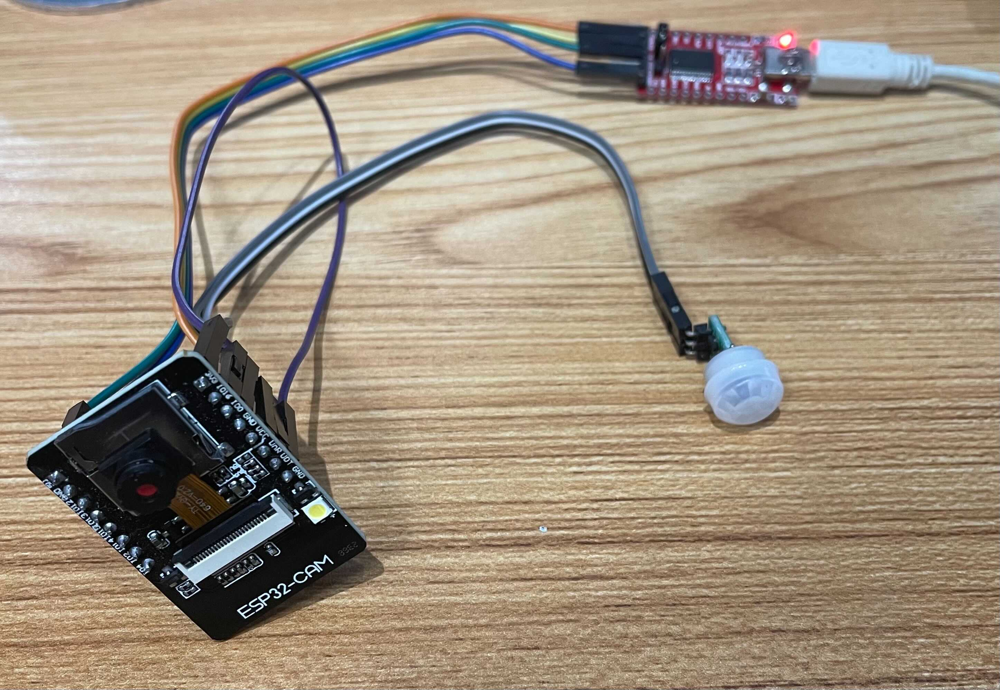

# The Yeti Cam Circuit



Note: I am using GPIO13 for the PIR sensor. Feel free to change the port to something
else by redefining `PIR_SENSOR_PORT` in [mqtt_demo_yeti_cam.c](main/mqtt_demo_yeti_cam.c).

## Searching for the 8th wonder of the world in a constrained environment

This project implements a battery-powered surveillance system that optimizes for energy usage.
A PIR sensor is used so that when motion is detected, an ESP32-CAM
will wake up from deep-sleep mode. When awoken, jpeg-encoded images are taken
while motion is detected. The images are published to an MQTT topic
over WiFi with a rule set to upload those images to S3. These steps are not 
necessarily sequential. The two cores provided by the ESP32 allows us to take photos
while sending them over MQTT concurrently by allocating separate tasks.

### Build Instructions

Install [esp-idf](https://github.com/espressif/esp-idf) and run the usual command
for flashing and monitoring an ESP board in the root directory of this repo
```
idf.py flash monitor -p$USB_PORT
```
